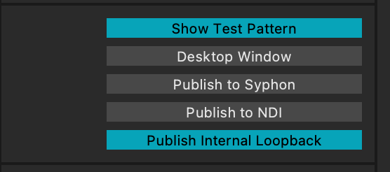
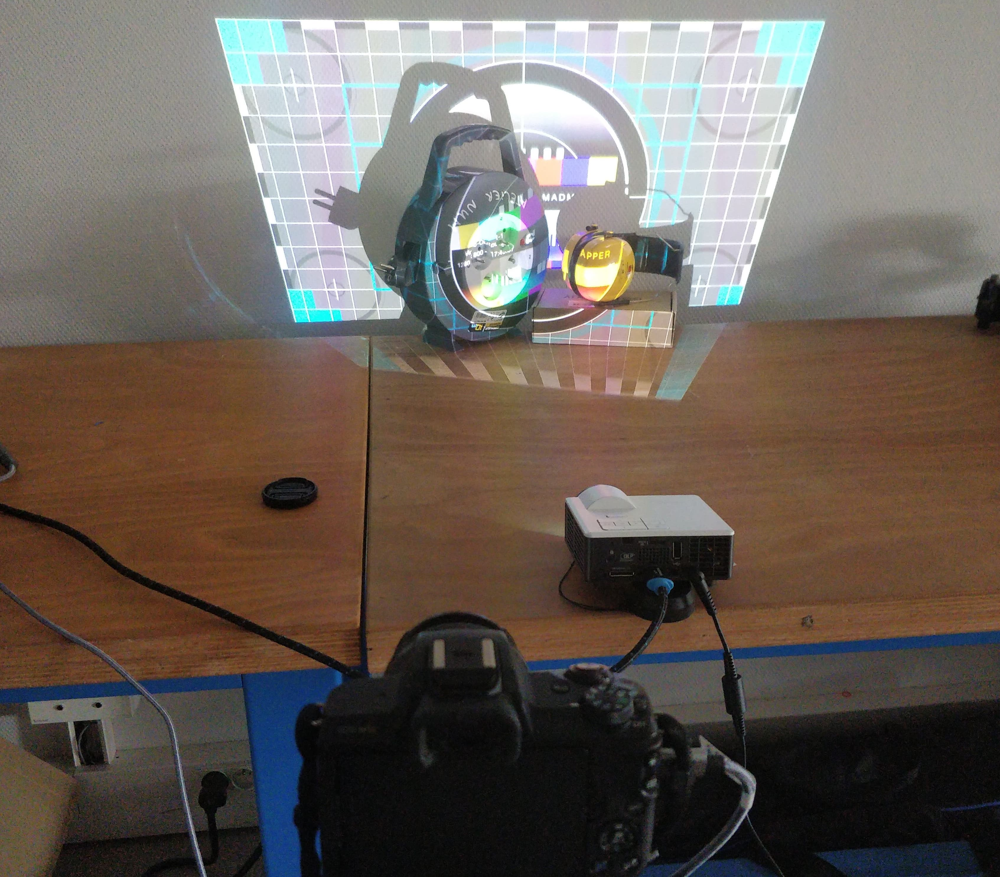
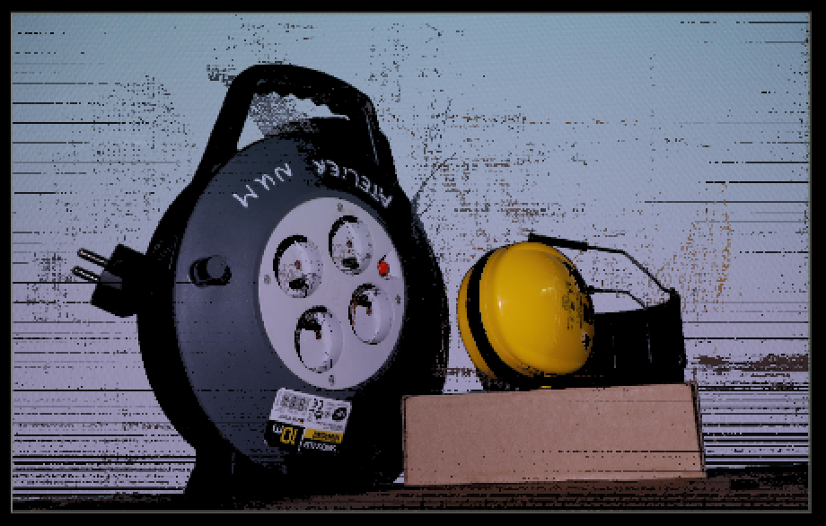

# MadMapper : utilisation du Spatial Scanner

Le but est de mettre en place rapidement un mapping sur une structure en utilisant un appareil photo et le scanner spatial de Madmapper. 

Pré-requis : 
- avoir lu le tuto [MadMapper_2spi](https://github.com/LucieMrc/Madmapper_2spi); 
- avoir un projecteur allumé, connecté, dont la projection couvre entièrement la structure/l'objet qu'on veux mapper; 
- avoir un appareil photo sur trépied, compatible avec le mode Spatial Scanner ([FAQ de MadMapper](https://madmapper.com/madmapper/faq)) relié à l'ordinateur.

## Mise en place

Caler les élements à mapper et placer le projecteur de manière à couvrir les élements avec la projection, en activant le mode `Show Test Pattern` dans l'onglet projection pour faire apparaître la mire de MadMapper.

 

Placer l'appareil photo sur trépied de manière à avoir toute la projection dans le viseur de l'appareil.

 

## Scan

Pour faire le scan, aller dans `Tools` > `Space Scanner...` dans la barre de menu.

Dans la fenêtre Space Scanner, sélectionner l'appareil photo utilisé.

Le processus dure quelques minutes, pendant lesquelles un enchaînement de rayures noires et blanches verticales puis horizontales sont projetées sur les élements.

L'image de sortie est une image représentant la "vue" du vidéo projecteur :

## Utilisation

Après la reconstitution de l'image du scan, elle s'ouvre directement en fond de projection dans l'interface de MadMapper, ce qui permet de caler directement des surfaces visuelles dessus.

 

L'image est également sauvegardé dans le dossier MadMapper et peut être utilisée dans des logiciels de création visuelle et vidéo afin de créer des textures à projeter.